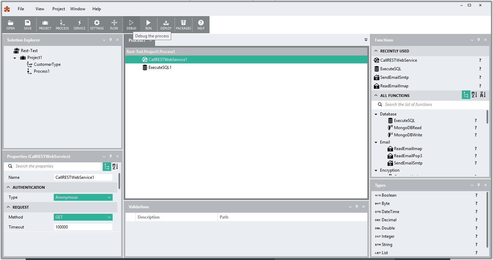
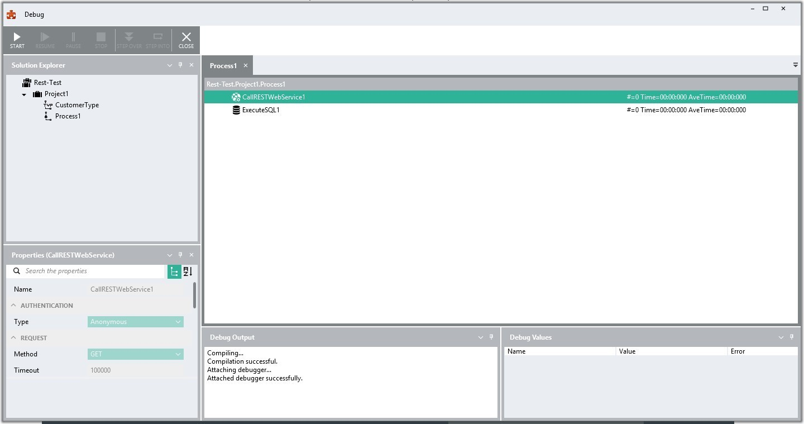
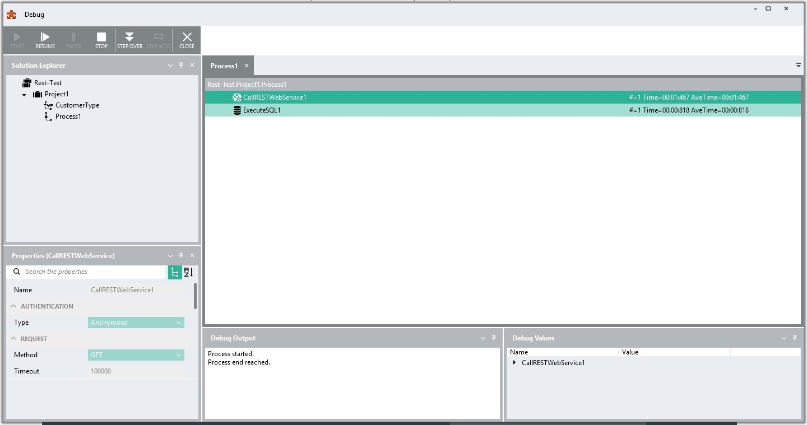

Debug
=====

The debug tool allows you to run a process while debugging. While
debugging, you can see the values used in the execution of the process.
Add breakpoints to review a specific function input or output values in
detail.

The debug menu item is in the toolbar. It only becomes active when a
process is selected.

When the debug tool is active, the application menu is replaced by the
debug menu. The properties panel now becomes inactive as you cannot
change the properties while debugging. Three other interface areas then
also change to facilitate debugging

-  #### Process tab

    Each function now has some information regarding the function
    execution details.

    *\#=0* indicates the number of times a function executed

    *Time=00:00:00 (minutes:seconds:milliseconds)* indicates the time
    taken to execute the last instance.

    *AveTime=00:00:00 (minutes:seconds:milliseconds)* is the average
    time this function required to execute.

-  #### Debug Output panel

    Here the status of the debug operation is shown.

    Initially, the panel will show the compilation status. If
    compilation is successful, the green *run* button in the debug menu
    becomes active so you can run and debug the process.

-  #### Debug Values panel

    Values used and generated in the execution of the process are shown
    in this panel.

When you hit *RUN* the *Debug Output* panel shows that the process has
started. The properties panel in the bottom left now becomes unavailable
for editing. You cannot make changes here while debugging.

While the debug process is running you can pause the execution using the
*Pause* button in the menu. You can also stop the execution with the
*Stop* button or end debugging altogether.

Adding a breakpoint to a function makes the debugger stop at that step
in the process. The *Debug Values* panel now shows the data that has
been processed. In the screenshot above, a web service was called and
returned some *ResponseHeaders* and some *ResponseBody* data.

In this state you can opt to continue the process (two arrows), stop the
process (stop icon) or continue and stop at the next function (rounded
arrow). If you are using the RunProcess function, you will also have an
option to step into the process being run by that component and debug it
(exclamation mark).

The Debug Output panel will let you know when the process has finished.
