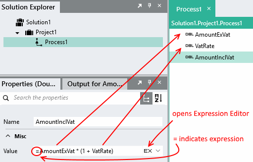
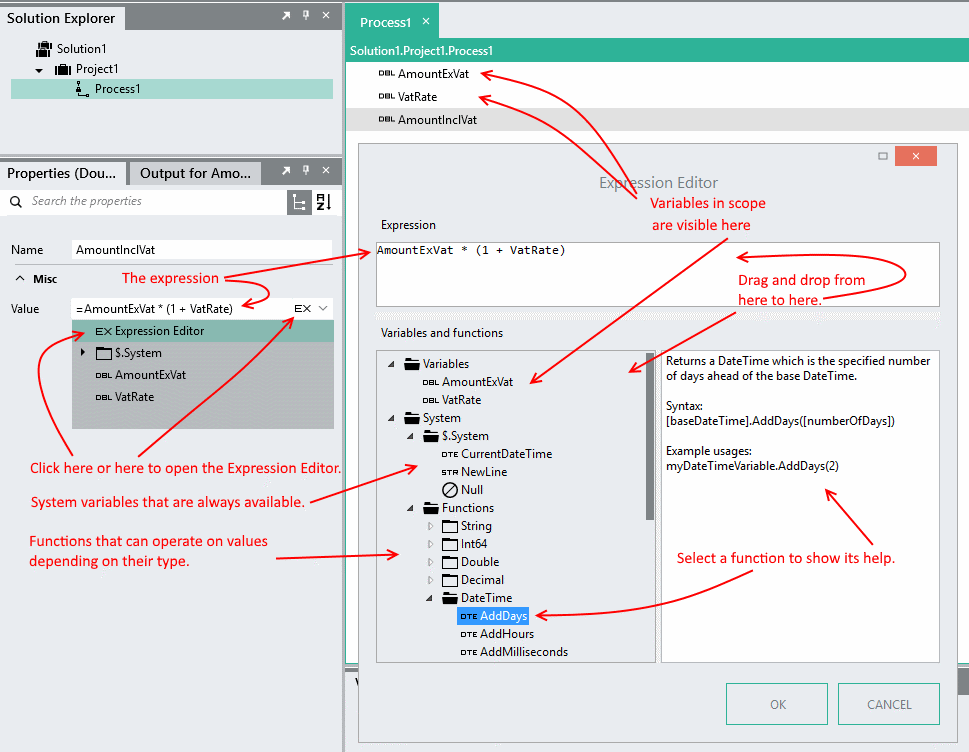
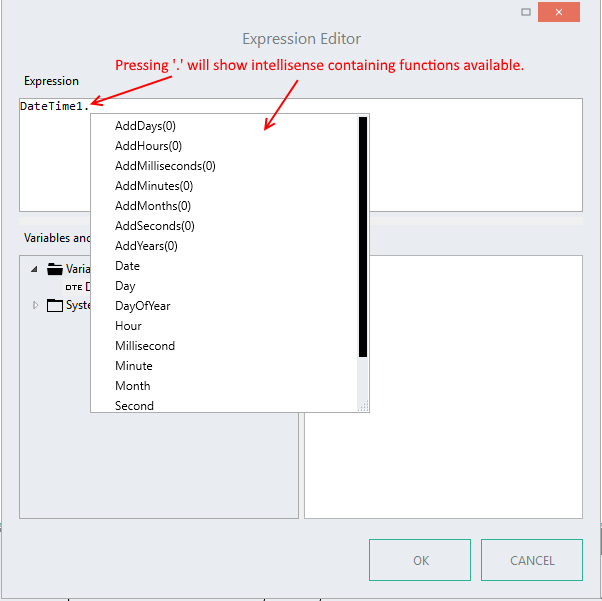

Expressions
=================

Linx uses C# expressions to evaluate values at run time.

## Concept
Excel uses expressions in cells. These expressions evaluate to a single value visible in the cell.
In a similar fashion Linx uses expressions when assigning values to properties. Linx expressions are evaluated at run time.
Excel expressions use VBA syntax. Linx expressions use C# syntax. Linx expressions in property windows are preceded by a "=".

## Definition
An Expression is a series of operands and 0 or more operators that evaluates to a single value.

#### Operands
Operands can be values, names or functions.

*Values* are numbers or strings e.g. `123`, `"abc"`. Strings are enclosed in double quotes.

*Names* refer to variables available in the scope of the expression e.g. `amount + 1` will add 1 to a variable called amount and return the result. Properties of variables are referred to using the dot notation e.g. Person.Age + 1 will add 1 to Person.Age and return the result.

*Functions* are operations that can be performed on another operand e.g. `Person.Birthdate.ToString("yyyy-MM-dd")` will return Person.Birthdate as a string formatted to look like "2016-12-31". Functions can be strung together e.g. `" 123,45 ".Trim().Replace(",",".")` will return 123.45.

#### Operators
Operators include

|--|--|
|+|Add, Concatenate
|-| Subtract
|*| Multiply
|/ |Divide
|<| Less than
	|<=| Less than or equal
|> |Greater than
| >=| Greater than or equal
|==| Equal
|!=| Not equal
|&& |And
|&#124;&#124;| Or

For a full list of C# operators see <https://msdn.microsoft.com/en-us/library/ms173145.aspx>. Linx does not support all the operators.

## Things you can do

#### String concatenation
Strings are concatenated using `+` e.g. `"ab" + "c"` evaluates to `"abc"`. Build a csv line with an expression like `Person.Name + "," + Person.Surname + $.System.NewLine`.

When strings are mixed with numbers the numbers are added until the first string is encountered. Thereafter operands are concatenated e.g.

`"1" + 2 + 3 + 4` will evaluate to `"1234"`.

`1 + 2 + "3" + 4` will evaluate to `"334"`.

#### String manipulation
Use functions like SubString, Trim, ToUpper, Split etc. to work with
string variables e.g. `TextFileRead1.FileContents.Replace("John","Peter")`
will replace all instances of "John" in the FileContents variable with
"Peter".

#### String formatting
Use FormatWith to create a string from several different inputs. The above csv sample can be built as `"{0},{1}{2}",FormatWith(Person.Name, Person.Surname, $.System.NewLine)`. The numbers inside curly braces refers to the index of the parameter in the FormatWith part.

For larger string formatting jobs rather use a templating function like [RazorTemplateTransform](../../../Plugins/Text/Functions/RazorTemplateTransform/).

#### Calculations
e.g. `AmountExVat * (1 + VatRate)`

#### Date operations
Format a date: `Person.Birthdate.ToString("yyyy-MM-dd")`

Return the month: `Person.Birthdate.Month`

#### Boolean expressions
In properties where true or false are expected the expression must return a boolean value e.g.

`Person.Name == "Mary"` (name is Mary)

`Person.Age < 10 && Amount > 500` (person is younger than 10 and amount is greater than 500)

## Expression Editor

The Expression Editor is available everywhere you use an expression.

Intellisense.

## Functions

Functions in an expression are operations that can be performed on data. Different functions applies to different types of data. Here is a list of functions according to the data type.

### String

#### Contains

Returns a boolean value which is true if the string in brackets is in the base string and false if it is not.

Syntax:
[baseString].Contains([referenceString])

Example usages: 
myStringVariable.Contains(""Some Words"")
myStringVariable.Contains(anotherStringVariable)
(""Some Words"").Contains(myStringVariable)
(""Some Words"").Contains(""Words"")

Notes:
This check is case sensitive so <<(""Some Words"").Contains(""Words"")>> will return true while <<(""Some Words"").Contains(""words"")>> will return false.

#### EndsWith

Returns a boolean value which is true if the string in brackets is at the end of the base string and false if it is not.

Syntax:
[baseString].EndsWith([referenceString])

Example usages: 
myStringVariable.EndsWith(""Some Words"")
myStringVariable.EndsWith(anotherStringVariable)
(""Some Words"").EndsWith(myStringVariable)
(""Some Words"").EndsWith(""Words"")

Notes:
This check is case sensitive so <<(""Some Words"").EndsWith(""Words"")>> will return true while <<(""Some Words"").EndsWith(""words"")>> will return false.

#### FormatWith

Returns a string where the format items ({0}, {1}, etc.) are replaced with string representations of the corresponding parameters.

Syntax:
[baseString].FormatWith([(params) parameterArray])

Example usages: 
myStringVariable.FormatWith(Boolean1, ""5"")
""{0} is {1} years old"".FormatWith(String1, Integer1)

#### IndexOf

Returns the character index of the first occurence of a reference string inside a base string. If the reference string is not in the base string then -1 is returned.

If a start index is specified, all occurences of the reference string before that index will be ignored.

Syntax:
[baseString].IndexOf([referenceString], [(optional)startIndex])

Example usages: 
myStringVariable.IndexOf(""Some Words"")
myStringVariable.IndexOf(anotherStringVariable)
(""Some Words"").IndexOf(myStringVariable)
(""Some Words"").IndexOf(""Words"")

myStringVariable.IndexOf(""Some Words"", 3)
myStringVariable.IndexOf(anotherStringVariable, 10)
(""Some Words"").IndexOf(myStringVariable, 5)
(""Some Words"").IndexOf(""Words"", 4)

Notes:
This check is case sensitive so <<(""Some Words"").IndexOf(""Words"")>> will return 5 while <<(""Some Words"").Contains(""words"")>> will return -1.

#### Insert

Returns a new string which is equal to the base string with the reference string inserted at the specified index.

Syntax:
[baseString].Insert([startIndex], [referenceString])

Example usages: 
myStringVariable.Insert(2, ""Some Words"")
myStringVariable.Insert(5, anotherStringVariable)
(""Some Words"").Insert(3, myStringVariable)
(""Some Words"").Insert(2, ""Words"")

Notes:
If the specified start index is less than 0 or more than the length of the base string then an exception will be thrown, so <<(""Some Words"").Insert(4, ""WORDS"")>> will return ""Some WORDS Words"" while <<(""Some Words"").Insert(20, ""WORDS"")>> will throw an exception.

#### LastIndexOf

Returns the character index of the last occurence of a reference string inside a base string. If the reference string is not in the base string then -1 is returned.

If a start index is specified, all occurences of the reference string after that index will be ignored.

Syntax:
[baseString].LastIndexOf([referenceString], [(optional)startIndex])

Example usages: 
myStringVariable.LastIndexOf(""Some Words"")
myStringVariable.LastIndexOf(anotherStringVariable)
(""Some Words"").LastIndexOf(myStringVariable)
(""Some Words"").LastIndexOf(""Words"")

myStringVariable.LastIndexOf(""Some Words"", 3)
myStringVariable.LastIndexOf(anotherStringVariable, 10)
(""Some Words"").LastIndexOf(myStringVariable, 5)
(""Some Words"").LastIndexOf(""Words"", 4)

Notes:
This check is case sensitive so <<(""Some Words"").LastIndexOf(""Words"")>> will return 5 while <<(""Some Words"").LastIndexOf(""words"")>> will return -1.

#### Length

Returns an integer value of the number of characters in the preceding string.

Syntax:
[baseString].Length

Example usage:
myStringVariable.Length
(""Some Words"").Length

Notes:
Spaces are counted as characters so <<(""Some Words"").Length>> will return 10

#### PadLeft

Returns a new string which is equal to the base string padded with spaces at its start. If a pad character is specified, then it will be used for the padding instead of a space.

Syntax:
[baseString].PadLeft([width], [(optional) padCharacter])

Example usages: 
myStringVariable.PadLeft(2)
myStringVariable.PadLeft(2, 'a')

#### PadRight

Returns a new string which is equal to the base string padded with spaces at its end. If a pad character is specified, then it will be used for the padding instead of a space.

Syntax:
[baseString].PadRight([width], [(optional) padCharacter])

Example usages: 
myStringVariable.PadRight(2)
myStringVariable.PadRight(2, 'a')

#### Remove

Returns a new string which is equal to the base string with all characters past the specified start index removed. If a count is specified then only that many characters are removed.

Syntax:
[baseString].Remove([startIndex], [(optional) count])

Example usages: 
myStringVariable.Remove(2)
myStringVariable.Remove(2, 2)
(""Some Words"").Remove(2)
(""Some Words"").Remove(2, 4)

Note:
If the specified start index is smaller than 0 or bigger than the length of the base string or the count added to the start index is beyond the length of the base string, then an exception will be thrown.

#### Replace

Returns a new string which is equal to the base string with all occurences of the a specified original string inside the base string being replaced with the specified new string.

Syntax:
[baseString].Replace([originalString], [newString])

Example usages: 
myStringVariable.Replace(anotherStringVariable, someOtherStringVariable)
myStringVariable.Replace(anotherStringVariable, ""Words"")
(""Some Words"").Replace(""Words"", someOtherStringVariable)
(""Some Words"").Replace(""Words"", ""words"")

Note:
This operation is case sensitive so <<(""Some Words"").Replace(""Words"", ""word"")>> will return ""Some word"" while <<(""Some Words"").Replace(""words"", ""word"")>> will return ""Some Words"".

#### Split

Returns a list of strings which contains the base string split up on each space character. If a character is specified, then the string will be split on that character instead of on space.

Syntax:
[baseString].Split([(optional)character])

Example usages: 
myStringVariable.Split()
myStringVariable.Split('$')
(""Some Words"").Split()
(""Some Words"").Split('W')

#### StartsWith

Returns a boolean value which is true if the string in brackets is at the beginning of the preceding string and false if it is not.

Syntax:
[stringToCheck].StartsWith([referenceString])

Example usages: 
myStringVariable.StartsWith(""Some Words"")
myStringVariable.StartsWith(anotherStringVariable)
(""Some Words"").StartsWith(myStringVariable)
(""Some Words"").StartsWith(""Words"")

Notes:
This check is case sensitive so <<(""Some Words"").StartsWith(""Some"")>> will return true while <<(""Some Words"").StartsWith(""some"")>> will return false.

#### SubString

Returns a string which is equal to the base string from a specified index onwards. If a length is specified then only that many characters are taken from the start index onwards.

Syntax:
[baseString].Substring([startIndex], [(optional)length])

Example usages: 
myStringVariable.Substring(2)
myStringVariable.Substring(2, 4)
(""Some Words"").Substring(2)
(""Some Words"").Substring(2, 3)

Notes:
If the start index is negative or bigger than the length of the base string, an exception will be thrown.

#### ToBytes

Converts a string value to a list of byte using the default encoding.

Syntax:
[baseString].ToBytes()

Example usage:
myStringVariable.ToBytes()
""10"".ToBytes()

#### ToBytesFromBase64

Converts a base64 string to a list of byte.

Syntax:
[base64String].ToBytesFromBase64()

Example usage:
myStringVariable.ToBytesFromBase64()

#### ToDateTime

Returns a DateTime item using the current string and input format to perform the conversion.

Syntax:
[baseString].ToDateTime(format)

Example usage: 
myStringVariable.ToDateTime(""yyyy/MM/dd HH:mm:ss"")

#### ToDecimal

Converts a string value to a decimal number.

Syntax:
[baseString].ToDecimal()

Example usage:
myStringVariable.ToDecimal()
""10.5"".ToDecimal()

#### ToDouble

Converts a string value to a double-precision floating-point number.

Syntax:
[baseString].ToDouble()

Example usage:
myStringVariable.ToDouble()
""10.5"".ToDouble()

#### ToInt32

Converts a string value to a 32-bit signed integer.

Syntax:
[baseString].ToInt32()

Example usage:
myStringVariable.ToInt32()
""10"".ToInt32()

#### ToInt64

Converts a string value to a 64-bit signed integer.

Syntax:
[baseString].ToInt64()

Example usage:
myStringVariable.ToInt64()
""10"".ToInt64()

#### ToLower

Returns a string equal to the base string but all in lower case.

Syntax:
[baseString].ToLower()

Example usage:
myStringVariable.ToLower()
(""Some Words"").ToLower()

#### ToUpper

Returns a string equal to the base string but all in upper case.

Syntax:
[baseString].ToUpper()

Example usage:
myStringVariable.ToUpper()
(""Some Words"").ToUpper()

#### Trim

Returns a string equal to the base string with all spaces removed from the beginning and end.

Syntax:
[baseString].Trim()

Example usage:
myStringVariable.Trim()
(""    Some Words    "").Trim()

#### TrimLeft

Returns a string equal to the base string with all spaces removed from the beginning.

Syntax:
[baseString].TrimStart()

Example usage:
myStringVariable.TrimStart()
(""   Some Words    "").TrimStart()

#### TrimRight

Returns a string equal to the base string with all spaces removed from the end.

Syntax:
[baseString].TrimEnd()

Example usage:
myStringVariable.TrimEnd()
(""    Some Words    "").TrimEnd()

### DateTime

#### AddDays

Returns a DateTime which is the specified number of days ahead of the base DateTime.

Syntax:
[baseDateTime].AddDays([numberOfDays])

Example usages: 
myDateTimeVariable.AddDays(2)

#### AddHours

Returns a DateTime which is the specified number of hours ahead of the base DateTime.

Syntax:
[baseDateTime].AddHours([numberOfHours])

Example usages: 
myDateTimeVariable.AddHours(2)

#### AddMilliseconds

Returns a DateTime which is the specified number of milliseconds ahead of the base DateTime.

Syntax:
[baseDateTime].AddMilliseconds([numberOfMilliseconds])

Example usages: 
myDateTimeVariable.AddMilliseconds(2)

#### AddMinutes

Returns a DateTime which is the specified number of minutes ahead of the base DateTime.

Syntax:
[baseDateTime].AddMinutes([numberOfMinutes])

Example usages: 
myDateTimeVariable.AddMinutes(2)

#### AddMonths

Returns a DateTime which is the specified number of months ahead of the base DateTime.

Syntax:
[baseDateTime].AddMonths([numberOfMonths])

Example usages: 
myDateTimeVariable.AddMonths(2)

#### AddSeconds

Returns a DateTime which is the specified number of seconds ahead of the base DateTime.

Syntax:
[baseDateTime].AddSeconds([numberOfSeconds])

Example usages: 
myDateTimeVariable.AddSeconds(2)

#### AddYears

Returns a DateTime which is the specified number of years ahead of the base DateTime.

Syntax:
[baseDateTime].AddYears([numberOfYears])

Example usages: 
myDateTimeVariable.AddYears(2)

#### Date

Returns a DateTime with time information stripped off.

Syntax:
[baseDateTime].Date

Example usages: 
myDateTimeVariable.Date

#### Day

Returns an integer value of the day of the month.

Syntax:
[baseDateTime].Day

Example usages: 
myDateTimeVariable.Day

#### DayOfYear

Returns an integer value of the day of the year.

Syntax:
[baseDateTime].DayOfYear

Example usages: 
myDateTimeVariable.DayOfYear

#### Hour

Returns an integer value specifying the hour value captured in the base DateTime.

Syntax:
[baseDateTime].Hour

Example usages: 
myDateTimeVariable.Hour

#### Millisecond

Returns an integer value specifying the millisecond value captured in the base DateTime.

Syntax:
[baseDateTime].Millisecond

Example usages: 
myDateTimeVariable.Millisecond

#### Minute

Returns an integer value specifying the minute value captured in the base DateTime.

Syntax:
[baseDateTime].Minute

Example usages: 
myDateTimeVariable.Minute

#### Month

Returns an integer value specifying the month value captured in the base DateTime.

Syntax:
[baseDateTime].Month

Example usages: 
myDateTimeVariable.Month

#### Second

Returns an integer value specifying the second value captured in the base DateTime.

Syntax:
[baseDateTime].Second

Example usages: 
myDateTimeVariable.Second

#### ToString

Returns a string value of the DateTime variable in the specified format. The format can be any combination of formatting values as shown below.

Syntax:
[baseDateTime].ToString([formatString])

Allowed formatting values:
Day
d, dd, ddd, dddd
1, 01, Mon, Monday

Month
M, MM, MMM, MMMM
1, 01, Jan, January

Year
y, yy, yyyy
4, 14, 2014

Hours
h, hh, H, HH
1, 01, 13, 13

Minutes
m, mm
6, 06

Seconds 
s, ss
8, 08

Milliseconds
f, ff, fff, ffff, fffff, ffffff, fffffff
6, 61, 615, 6157, 61574, 615743, 6157436

AM/PM
t, tt
A, AM

Era
gg
A.D.

Time and Date Seperators
:, /, -
:, /, -

UTC Offset
z, zz, zzz
+2, +02, +02:00

Example usages: 
myDateTimeVariable.ToString(""yyyy-M-d hh:mm tt zz"")

#### Year

Returns an integer value specifying the year value captured in the base DateTime.

Syntax:
[baseDateTime].Year

Example usages: 
myDateTimeVariable.Year

### Decimal

#### ToDouble

Converts a decimal number to a double-precision floating-point number.

Syntax:
[baseDecimal].ToDouble()

Example usage:
myDecimalVariable.ToDouble()

#### ToInt64

Converts a decimal value to a 64-bit signed integer.

Syntax:
[baseDecimal].ToInt64()

Example usage:
myDecimalVariable.ToInt64()

### Double

#### ToDecimal

Converts a double-precision floating-point number to a decimal number.

Syntax:
[baseDouble].ToDecimal()

Example usage:
myDoubleVariable.ToDecimal()

#### ToInt64

Converts a double value to a 64-bit signed integer.

Syntax:
[baseDouble].ToInt64()

Example usage:
myDoubleVariable.ToInt64()

### Integer

#### ToInt32

Converts a 64-bit signed integer to a 32-bit signed integer.

Syntax:
[baseInteger].ToInt32()

Example usage:
myIntegerVariable.ToInt32()

### List

#### Any

Determines whether a sequence contains any elements.

Syntax:
\[list].Any([(optional)condition])

Example usages: 
listOfCars.Any()
listOfPeople.Any(person => person.Name == ""John"")

#### Average

Computes the average of a sequence of numeric values.

Syntax:
\[list].Average([(optional)selector])

Example usages: 
listOfNumbers.Average()
listOfPeople.Average(person => person.Age)

#### Count

Returns the number of elements in a sequence..

Syntax:
\[list].Count([(optional)condition])

Example usages: 
listOfCars.Count()
listOfPeople.Count(person => person.Name == ""John"")

#### Max

Returns the maximum value in a sequence of values.

Syntax:
\[list].Max([(optional)condition])

Example usages: 
listOfNumbers.Max()
listOfPeople.Max(person => person.Age)

#### Min

Returns the minimum value in a sequence of values.

Syntax:
\[list].Min([(optional)selector])

Example usages: 
listOfNumbers.Min()
listOfPeople.Min(person => person.Age)

#### Sum

Computes the sum of a sequence of numeric values.

Syntax:
\[list].Sum([(optional)selector])

Example usages: 
listOfNumbers.Sum()
listOfPeople.Sum(person => person.Age)

### List(Byte)

#### ToBase64

Returns the list of bytes as a Base64 string.

Syntax:
[listOfByte].ToBase64()