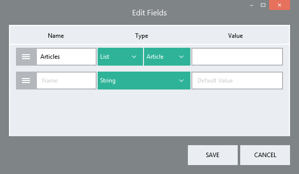
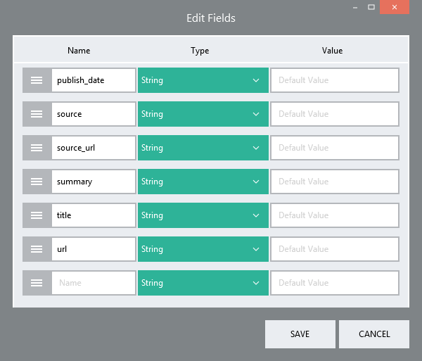

Custom Type
===========

You can create your own type in Linx by defining its' structure. These are typically complex types, types that consist of a variety of other types and sub-types. 

You can drag a custom type onto the canvas and populate it with data that conforms to its' structure. For example, a custom type might be a *'Customer'*. Such a customer would probably have properties like *Name*, *Address* and a *list of
purchases*. When you create this type, you will want to specify that the
type has a string field called 'Name', another string field with an
*address* and a *list of purchases*. A *purchase* is also a type and you
will need to create it first. It may consist of a *purchase date*, an
*amount* and a *product*. So, you will also need to create a *purchase*
type with a date type called *'purchase date'*, a decimal called
*'purchase amount'* and a string called *'Product Name'*. You have now
created a complex type for storing a customer and all related purchases.

When you point this type at a database query result that has the same
fields, you can get Linx to automatically populate the complex type
directly from your SQL query.

An example of the definition of a custom type is shown below. This
definition is for a *list of articles*. Each *article* consists of a
collection of fields, such as *publish\_date*, *summary* and *title*.

