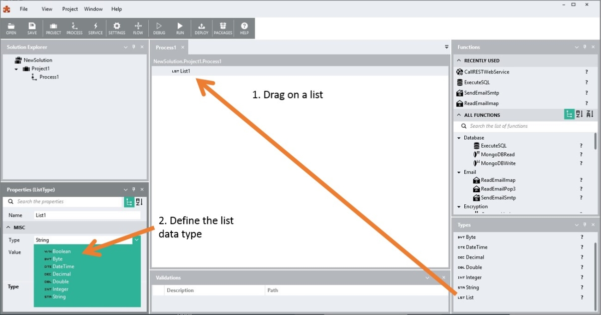

List
====

A list type is an object that can hold a list of other types. When you drag a list onto the canvas, you can populate it with a list of other types.

With a list type you can, for example, make a list of strings, a list of dates, a list of custom types or of any other type Linx caters for.

Use the [AddToList](~/Support/BuiltIn/Functions/AddToList/) function to append values to your list dynamically. Use the [ClearList](~/Support/BuiltIn/Functions/ClearList/) function to remove all values from a list. 

#### Videos
[Linx 5 Lists and ForEach ](https://www.youtube.com/watch?v=VfIWh2P7mSU)
