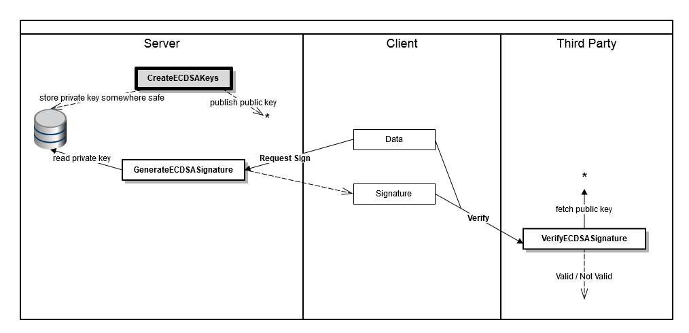
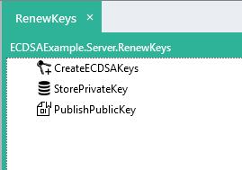

CreateECDSAKeys
===========

Creates a new Elliptic Curve Digital Signature Algorithm (ECDSA) public/private key pair.

In the diagram below, the keys are stored appropriately, where the private key will be used to sign data and 
the public key used to verify the signature.  
  
Also see: [GenerateECDSASignature](../GenerateECDSASignature/), [VerifyECDSASignature](../VerifyECDSASignature/).

Properties
----------

-  #### Algorithm

    Select which curve (P-256, P-384, or P-512) to use for the Elliptical Curve Digital Signature Algorithm (ECDSA).  

Output
------

-  The new public key and private key.

Example
-------

The example below shows a simple usage scenario where the private key is stored in a database that is 
accessible only from the local machine and the public key is stored in a file on public network-attached 
storage.

Links
-----

- [Wikipedia: Elliptic Curve Digital Signature Algorithm](https://en.wikipedia.org/wiki/Elliptic_Curve_Digital_Signature_Algorithm)
