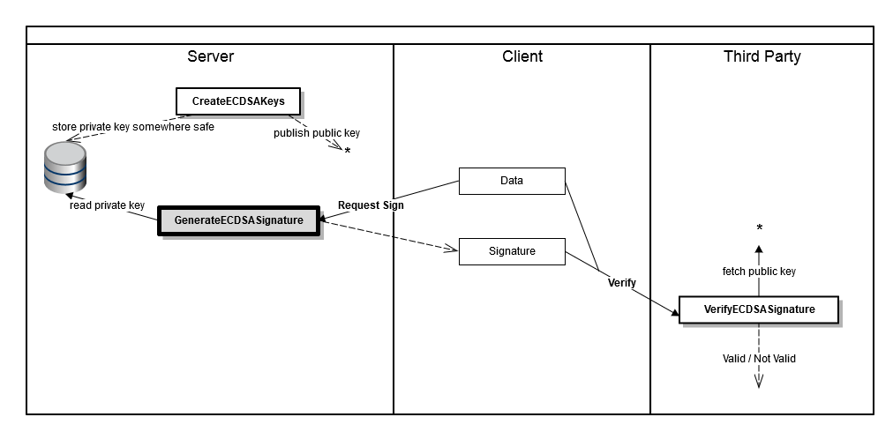
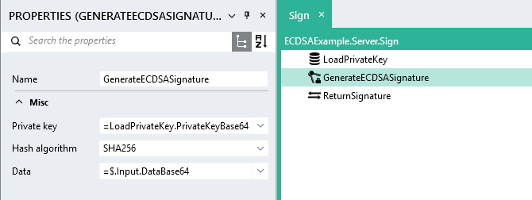

GenerateECDSASignature
===========

Signs data using an Elliptic Curve Digital Signature Algorithm (ECDSA) private key.

In the diagram below, the dark rectangle represents the activity of signing some data using a private key that 
is stored at a safe location.  
  
Also see: [CreateECDSAKeys](../CreateECDSAKeys/), [VerifyECDSASignature](../VerifyECDSASignature/).

Properties
----------

-  #### Private key

    The private ECDSA key to use to generate the signed data (see [CreateECDSAKeys](../CreateECDSAKeys/)).   
    The key can be given as a list of bytes or a base64 string.

-  #### Hash algorithm

    The hash algorithm to use when signing the data. The options are *SHA256*, *SHA384*, or *SHA512*.

-  #### Data

    The data to sign. This can be a list of bytes or a base64 string.

Output
------

-  The ECDSA signature in the form of a list of bytes.

Example
-------

The example below shows a simple process where the private key is retrieved from a local database and used to 
sign some data which is received as input.

Links
-----

- [Wikipedia: Elliptic Curve Digital Signature Algorithm](https://en.wikipedia.org/wiki/Elliptic_Curve_Digital_Signature_Algorithm)
