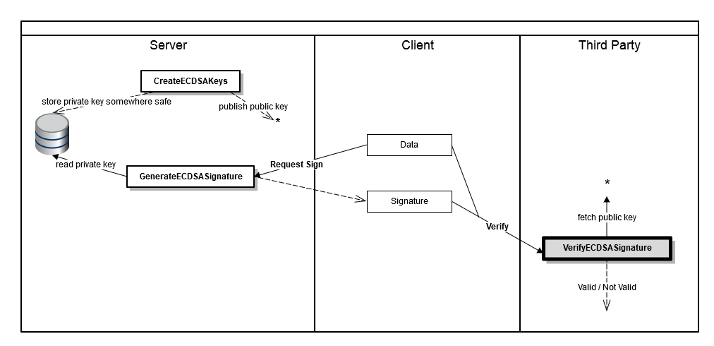

VerifyECDSASignature
===========

Verifies a digital signature against the specified Elliptic Curve Digital Signature Algorithm (ECDSA) public key.

In the diagram below, the dark rectangle represents the activity of verifying a signature against some data using 
a public key that is retrieved from the server which signed the data.  
  
Also see: [CreateECDSAKeys](../CreateECDSAKeys/), [GenerateECDSASignature](../GenerateECDSASignature/).

Properties
----------

-  #### Public key

    The public ECDSA key against which to verify the signature (see [CreateECDSAKeys](../CreateECDSAKeys/)).  
    The key can be given as a list of bytes or a base64 string.

-  #### Hash algorithm

    The hash algorithm that was used to sign the data.

-  #### Data

    The data against which to verify the signature. This can be a list of bytes or a base64 string.

-  #### Signature

    The signed data to verify (see [GenerateECDSASignature](../GenerateECDSASignature/)). This can be a list of 
    bytes or a base64 string.

Output
------

-  A [boolean](~/Support/BuiltIn/Types/Boolean/) value (*true* / *false*) indicating if the specified signature 
   is valid given the public key and data.

Example
-------

The example below shows a simple process that retrieves a public key from a server and uses it to verify a 
specified signature against the specified data.

Links
-----

- [Wikipedia: Elliptic Curve Digital Signature Algorithm](https://en.wikipedia.org/wiki/Elliptic_Curve_Digital_Signature_Algorithm)
