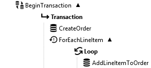

BeginTransaction
==========

Starts a transaction in a database to facilitate performing multiple database operations on the same transaction.

This function creates a Transaction object in its execution path that can be used by the 
[ExecuteSQL](../ExecuteSQL/) or [ExecuteStoredProcedure](../ExecuteStoredProcedure/) functions. See the 
[example](#example) below. 

The transaction is committed automatically after all the functions in the execution path finished executing. If 
an error occurs inside the execution path, the transaction is rolled back.

Properties
----------

- #### Connection type {#connectiontype-property}
The type of database driver to use to connect to the database. The supported driver types are *SQL Server*, 
*Oracle*, *OLE DB*, and *ODBC*. 

- #### Connection string
The [connection string](../../Tools/ConnectionEditor/) that specifies how to connect to the database.

- #### Isolation level
The isolation level for the transaction to use. The available options depend on the 
[Connection type](#connectiontype-property) chosen.

Example {#example}
----------

Suppose you have a variable containing an order with several line items that needs to be added to the database.
Using [ExecuteSQL](../ExecuteSQL/) without BeginTransaction would create a new database connection for each item 
written to the database. By using BeginTransaction, we can add everything in the same transaction. If something 
should go wrong during the creation of the order, the entire transaction would be rolled back, guaranteeing that 
we never end up having incomplete orders in the database. Adding many records using the same transaction will 
also execute a lot faster.

Set up the database connection on the BeginTransaction function. Then, for each ExecuteSQL, set the 
'Connection type' property to *Use transaction*, and set the 'Transaction' property to 
'BeginTransaction.Transaction'. 

Links
----------

- [Wikipedia: Database transaction](https://en.wikipedia.org/wiki/Database_transaction)
- [Wikipedia: Isolation (database systems)](https://en.wikipedia.org/wiki/Isolation_%28database_systems%29)
