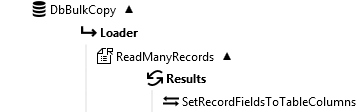

DBBulkCopy
==========

DBBulkCopy allows to efficiently copy large amounts of rows to a table in a SQL Server or Oracle database. 

This function creates a Loader object in its execution path. Use the [SetValue](~/Support/BuiltIn/Functions/SetValue/)
function to add rows to insert. See the [example](#example) below.

Properties
----------

- #### Connection type
The type of database driver to use to connect to the database. The supported driver types are 
*SQL Server* and *Oracle*.

- #### Connection string
The [connection string](../../Tools/ConnectionEditor/) that specifies how to connect to the database.

- #### Table name
The name of the destination table.

- #### Batch size
The number of rows to collect in a transaction before it is committed to the server.

Example {#example}
--------

Suppose you have a CSV text file with many records that need to be loaded into a database table.
Using the DbBulkCopy function as shown below will run much quicker than doing it using the 
more generic [ExecuteSQL](../ExecuteSQL/) function.

Set the 'Target' property of the SetValue function to 'DbBulkCopy.Loader.Write'. Then click the editor 
button '...' next to the 'Source' property to open the Set Fields editor to assign the values to
the table's columns.
