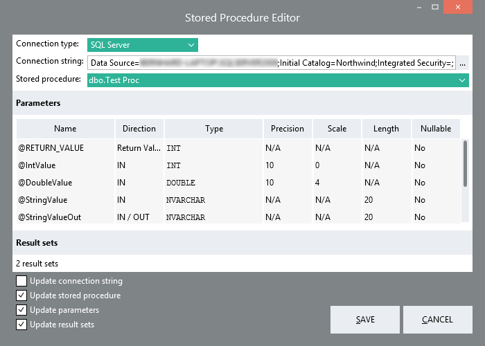

ExecuteStoredProcedure
==========

Use the "Row by row" option of this
function's Return options when retrieving large datasets!

ExecuteStoredProcedure runs a stored procedure on a database. It allows specifying values for parameters to send 
to the stored procedure and it returns the values of any out-parameters. If the stored procedure returns one or 
more result sets (tables), its rows can be received one at a time in a loop, or all at once in a list.

Properties
----------

### Misc

- #### Connection type {#connectiontype-property}
The type of database driver to use to connect to the database. The supported driver types are *SQL Server*, 
*Oracle*, *OLE DB*, and *ODBC*. Alternatively, instead of creating a new connection, choose *Use transaction* 
to use a Transaction object from a [BeginTransaction](../BeginTransaction/) function.

- #### Connection string
The [connection string](../../Tools/ConnectionEditor/) that specifies how to connect to the database.

- #### Transaction
Visible if [Connection type](#connectiontype-property) is set to *Use transaction*. Allows to select the 
Transaction object from a [BeginTransaction](../BeginTransaction/) function.

- #### Stored procedure
The name of the stored procedure on the database to call. Use the 
[Stored procedure editor](#stored-procedure-editor) to discover all available stored procedures in the database.

- #### Parameters {#parameters-property}
Define the collection of parameters that the stored procedure expects. Each IN or IN/OUT parameter will appear 
as a property in the [Parameter values](#parameter-values-category) section. Each IN/OUT, OUT, and Return value 
will be included as properties in the [function's output](#output).

### Parameter values {#parameter-values-category}

For each parameter defined with a direction of IN or IN/OUT, an additional property will appear in this section 
to allow to specify the value to pass for that parameter.

### Result sets {#result-sets-category}

The PL/SQL code of a stored procedure may contain 'SELECT' statements which cause a result set (table) to be returned by each one of these statements. 

- #### Number of result sets
The number of result sets returned by the stored procedure. You can click the ellipse (...) button to open the [Stored procedure editor](#stored-procedure-editor) to try detect the result set fields from the database.

- #### Result set fields
One property will appear for each result set for configuring its fields.

- #### Output option {#output-option-property}
	- *First row*  
	The function will return only the first row of each result set. If any result set returns no data, an error 
    will be thrown.
	- *First row, else empty row*  
	The function will return only the first row of each result set. When a result set returns no data, the 
    function will return a row containing default values.
	- *List of rows*  
	The function will return the rows of each result set in separate lists.
	- *Row by row*  
	The function will return the rows of each result set one row at a time in a loop. This is recommended 
    whenever you expect to retrieve many items, but you don't need the complete list of items all at once.

Output {#output}
----------

The function's output contains the values of all IN/OUT, OUT, and Return value parameters configured in the 
[Parameters](#parameters-property) property.  
The output also contains one property for each [result set](#result-sets-category) containing the data returned
(unless the [Output option](#output-option-property) was set to *Row by row*).

Stored procedure editor {#stored-procedure-editor}
----------

The stored procedure editor allows you to select the stored procedure to call from a list. It also detects the 
parameters and result sets of the selected stored procedure and optionally updates the corresponding properties.

Toggle the *Update*-checkboxes to select what to update when you click on SAVE.

Links
----------

- [Wikipedia: Stored procedure](http://en.wikipedia.org/wiki/Stored_procedure)
