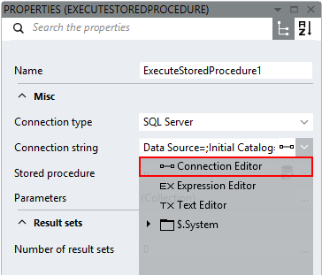

# Connection Editor

The connection string specifies the configuration values required by the data provider to connect to the database. The content of the connection string depends on the database driver used. The Connection Editor helps build the connection string by offering the most common connection properties depending on the selected connection type.

### Samples

#### SQL Server

- **Not named, Windows authentication**
    <pre>Data Source=<em>serverAddress</em>;Initial Catalog=<em>databaseName</em>;Integrated Security=True;</pre>

- **Named server, no Windows authentication**
     <pre>Data Source=<em>serverName\instanceName</em>;Initial Catalog=<em>databaseName</em>;Integrated Security=;User ID=<em>username</em>;Password=<em>password</em>;</pre>

#### Oracle

- **Using TNS-names entry**
    <pre>Data Source=<em>TNSname</em>;User ID=<em>username</em>;Password=<em>password</em>;</pre>

- **Without using TNS-names entry**
    <pre>Data Source=(DESCRIPTION=(ADDRESS=(PROTOCOL=TCP)(HOST=<em>serverAddress</em>)(PORT=<em>port</em>))(CONNECT_DATA=(SERVER=DEDICATED)(SERVICE_NAME=<em>serviceName</em>));User ID=<em>username</em>;Password=<em>password</em>;</pre>

#### OLE DB

- **Windows authentication**
    <pre>Provider=sqloledb;Data Source=<em>serverAddress</em>;Initial Catalog=<em>databaseName</em>;Integrated Security=SSPI;</pre>

- **No Windows authentication**
    <pre>Provider=sqloledb;Data Source=<em>serverAddress</em>;Initial Catalog=<em>databaseName</em>;Integrated Security=;User ID=<em>username</em>;Password=<em>password</em>;</pre>

#### ODBC

- **Microsoft Access database**
    <pre>Driver={Microsoft Access Driver (*.mdb)};DBQ=<em>databaseFilePath</em>;</pre>

- **System Data Source Name, Windows authentication**
    <pre>DSN=<em>dataSourceName</em>;Trusted_Connection=Yes;</pre>

- **System Data Source Name, no Windows authentication**
    <pre>DSN=<em>dataSourceName</em>;Uid=<em>username</em>;Pwd=<em>Password</em>;</pre>

## Links

##### Connection strings
- [Wikipedia: Connection string](http://en.wikipedia.org/wiki/Connection_string)
- [The Connection Strings Reference](http://www.connectionstrings.com/)
##### ODBC
- [Wikipedia: ODBC](http://en.wikipedia.org/wiki/Open_Database_Connectivity)
- [Microsoft Support: HOW TO: Create a System Data Source Name (DSN)](http://support.microsoft.com/kb/305599)
- [MSDN: ODBC connection string](https://msdn.microsoft.com/en-us/library/windows/desktop/ms722656(v=vs.85).aspx)
