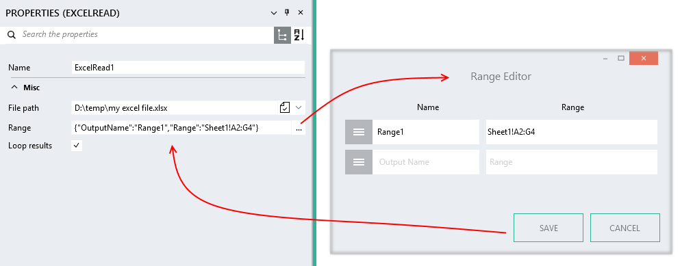

ExcelRead
=========

This function supports files that have been
created using Microsoft Excel 2007 or later (.xlsx file
extension). It is not required to have Excel installed to use this function.

ExcelRead reads data from an Excel spreadsheet file.

Properties
----------

-  #### File path

    The file path of the xlsx file to read.

-  #### Range

	The range property specifies an OutputName and a Range in the format {"OutputName":"Range1","Range":"Sheet1!A2:G4"}. Use the Range Editor to edit it. You can also specify multiple ranges. 

	OutputName can be any valid Linx name. 

	Range is specified using the [A1 reference style](https://support.office.com/en-US/article/Overview-of-formulas-d258ec72-149a-42ac-8eae-b50a667eb491?ui=en-US&rs=en-US&ad=US#bmusing_references_in_formulas),
    e.g. 'A1:D3', or 'Sheet3!B3'. You can also reference a sheet using its index e.g. '\\\1!B3' will reference the first sheet in the workbook.

	

-  #### Loop results

    This option is available only when at least one of the ranges
    references multiple rows.

    If checked, the rows will be returned one at a time in a loop. If
    more than one range is specified, a separate loop is created for
    each range.

    If not checked, a list containing all the rows will be created. If
    more than one range is specified, one list for each range will be
    returned.

Links
-----

-  [Office Open XML file format](https://en.wikipedia.org/wiki/Office_Open_XML)
-  [Office Support: The A1 reference style](https://support.office.com/en-US/article/Overview-of-formulas-d258ec72-149a-42ac-8eae-b50a667eb491?ui=en-US&rs=en-US&ad=US#bmusing_references_in_formulas)
