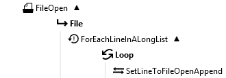

FileOpen
========

FileOpen keeps a file open for speeding up large numbers of write operations.

This function creates a FileHandle object in its execution path that can be used by the 
[TextFileWrite](../TextFileWrite/) or [BinaryFileWrite](../BinaryFileWrite/) 
functions to write to the opened file. You can also use the [SetValue](~/Support/BuiltIn/Functions/SetValue/) 
function to assign values to the FileHandle's 'Append' property to add content that way. See 
the [examples](#examples) below.

Properties
----------

-  #### File path

    The path to the file to keep open for writing.

-  #### Is text {#is-text-property}

    Indicate if the file to open (or create) is a text file.

-  #### Codepage

    Visible if the [Is text](#is-text-property) option is checked. 
    Selects the character encoding to use when writing text to the file.
    
    The default Codepage is the codepage used in your operating system.

-  #### File does not exist

    You can opt to create the file or return an error if the file
    already exists.

-  #### File exists

    If the file already exists:

    *Append data* will cause that any text that is written to the file is added to the end 
    of that file.

    *Increment file name* will add a number to the file name to make that name unique. This 
    is a sequential number starting with 1.

    *Overwrite file* will replace all content in the file with the new content.

    *Throw exception* will stop the process and return an error.

Examples {#examples}
--------

Suppose you have a long list of lines of text to write to a file. Using the FileOpen function 
as shown below will run much quicker than doing it without the FileOpen function. 

-  #### Use with [TextFileWrite](../TextFileWrite/)

    Set the 'File path' property of the TextFileWrite function to 'FileOpen.File.FileHandle'. 

    

-  #### Use with [SetValue](~/Support/BuiltIn/Functions/SetValue/)

    Set the 'Target' property of the SetValue function to 'FileOpen.File.FileHandle.Append' 
    or 'FileOpen.File.FileHandle.AppendLine'. 'AppendLine' will add a line-terminator after 
    the text.

    

Links
-----

[Wikipedia: Code page](http://en.wikipedia.org/wiki/Code_page)

[Joel on Character Sets](http://www.joelonsoftware.com/articles/Unicode.html)

[Go Global Developer Center: Code pages](http://msdn.microsoft.com/en-us/goglobal/bb964653.aspx)
